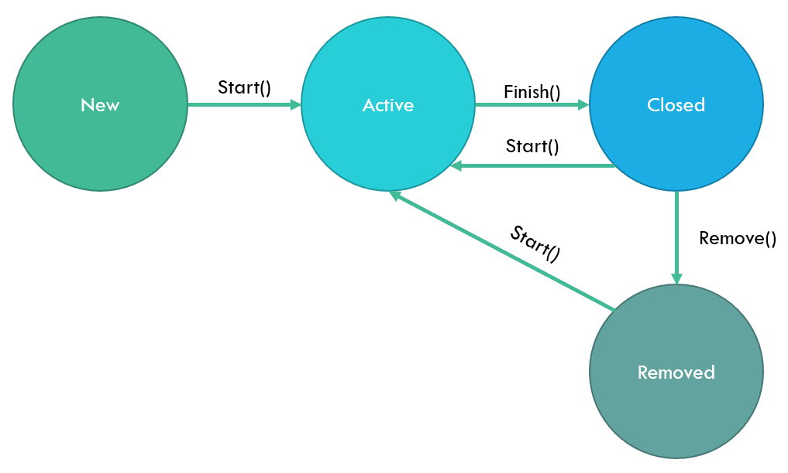

# process-util

## Prerequisites

Download and install [dotnet core SDK](https://dotnet.microsoft.com/download/dotnet-core) (>= 3.1)

## How to

Implement the requirements (below) in the `ProcessUtil` project.  
Verify expected behavior by running the unit tests using cmd / bash:

```
git clone https://github.com/andreassjoberg/process-util.git
cd process-util
dotnet test
```

## Requirements

Implement the following status transitions for `Task` and `Project`:


The following behavior is expected:

- Calling `Start()` should change the status from `New` to `Active`
  - Calling `Start()` on an `Active` task or project should result in no change
  - Calling `Start()` on a `Closed` or `Removed` task or project changes the status to `Active`
- Calling `Finish()` should change the status from `Active` to `Closed`
  - Calling `Finish()` on a `New` or `Removed` task or project should throw an `InvalidOperationException`
  - Calling `Finish()` on a `Closed` task or project should result in no change
- Calling `Remove()` should change the status from `Closed` to `Removed`
  - Calling `Remove()` on a `New` or `Active` task or project should throw an `InvalidOperationException`
  - Calling `Remove()` on a `Removed` task or project should result in no change

Additionally the following relational behavior is expected:

- A project must be active before a task can be started
  - Attempting to start a task before a project is started should result in an `InvalidOperationException`
- A project cannot be closed before all tasks are closed or removed
